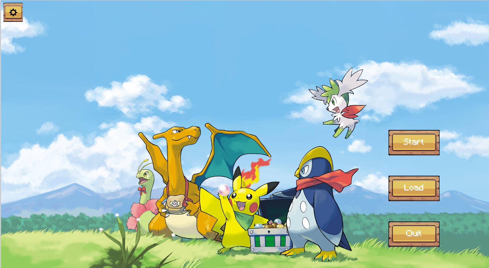
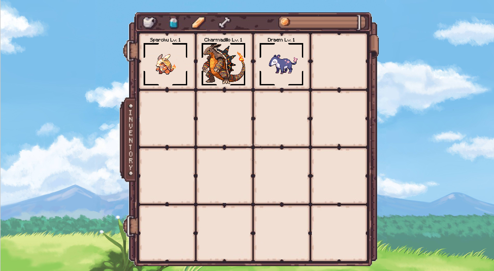
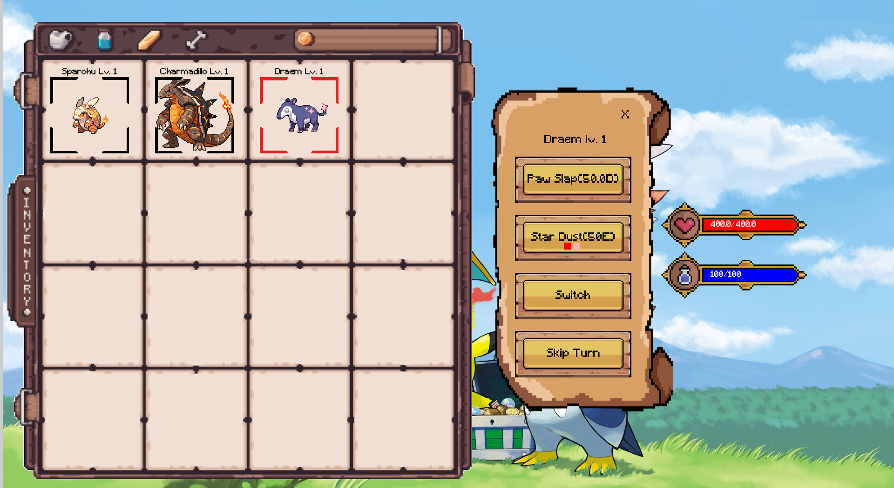
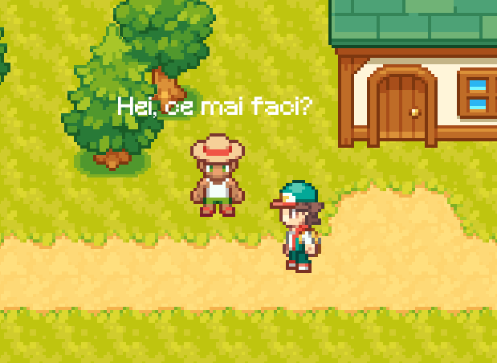
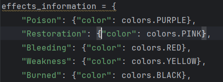
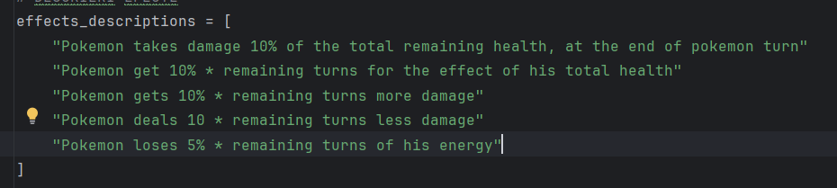
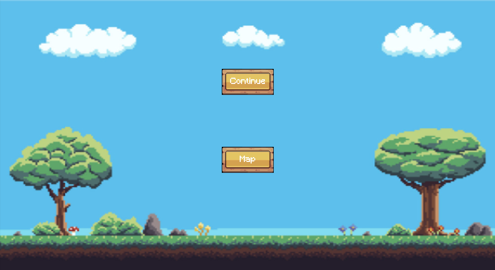
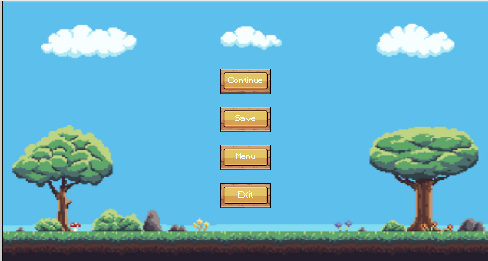

# Pokemon Game with PyGame

## Description

A Pokémon-inspired game built with PyGame, featuring tile-based maps across diverse environments. It includes 
interactive characters with collision detection, seamless scene transitions, and a user-friendly main menu. The project 
offers rich graphics, animations, and sound effects, providing an immersive and dynamic gaming experience.
The game was divided into multiple folders in order to maintain clarity and code reusability.

When you open the game via the terminal using "python3 ./main.py" the first aspect you see is the Main Menu. It contains 4 buttons:
start, load, exit and settings (which currently is not implemented)

When you press start the game begins on the map where you can move up, left, right or down using the WASD keys. The character on screen
is able to do multiple things on the map.
By pressing E you can open your inventory. Here you can see all of your pokemons, right now these are the starting pokemons

You can see that your pokemons have a black box around them, this means that they are selected and you can enter in battle with them.
In every battle you will have to choose exactly 3 pokemons. During tha game you are going to collect several pokemons by fighting with
other NPC-s pokemons or wild ones.
In order to reselect the pokemons you want to have in battle, you can press R in the inventory and choose 3
If you want to delete a pokemon you can use the delete key and choose how many pokemons you want to delete by clicking on them, when you are done,
press delete again to cancel.
To exit the menu press E again.
In the inventory you can also select a pokemon in order to see its stats, by doing this you can see in the right its ability screen, health and energy/mana
You can see that a particular pokemon is selected because a red box is going to appear around it in the inventory

In order to fight other pokemons in battle you have 2 options, either run around the grass located around the world and by doing this a random
pokemon battle is going to start or by going to speak with other NPC-s.
To talk to an NPC you have to press F next to it, after reading one of its lines press F again to show the next one until the battle starts.

In battle you can select your pokemon and an ability screen is going to popup

The first button represents the main attack, this one only gives damage to the enemy. The damage is in paranthesis and followed by D
The second button is the special ability, under the name there are some effects that the special ability apply to the other pokemon
or if it is a good effect ofn itself.
These are the effects:

And this is what they do: hope the descriptions are correct :))

Some of the effects are applyed when you attack and some of them when you are attacked.
The effects appear next to the pokemon, the color represent the effect and the number the turns it lasts. If you reattack with a specific
effect the turns add up. Every special attack gives two stacks of every effect it applies.
The third button allows you to change the pokemon you want to attack with and the last one regens a third or 30% of your energy/mana.

When the battle ends you have a chance to get one of the pokemons you fought and you don t have. It's 100% when you fight a NPC and 33% when
you get a battle in the grass.

We also have implemented an exit menu. In the battle you have to options, either continue the battle or go to map. In the map you can do 
4 things: continue which I think is suggestive, menu which allows you to go to main menu, save which saves your progress and exit which 
closes your game.

Pressing Load in the Main Menu allows you to get back where you last time saved. !! BE CAREFUL !! Starting the game again deletes your save.
We would like to implement in the future the ability to have multiple save files, but right now you cannot.

## Main Features

-   **Tile-based Mapping**
    -   Uses TMX files for creating and managing game maps.
    -   Supports multiple environments like plant, arena, house, and water.

-   **Game Entities and Characters**
    -   Defines characters with properties such as direction, graphic, and radius.
    -   Implements collision detection and interaction zones.

-   **Main Menu Interface**
    -   Features a  `MainMenu`  class for navigating game options.
    -   Includes buttons for settings and other functionalities.

-   **Scene Transitions**
    -   Manages transitions between different game areas seamlessly.
    -   Handles loading and unloading of map data.

-   **Collision Detection**
    -   Defines collision zones within TMX files to manage interactions.
    -   Ensures characters interact correctly with the environment.

-   **Graphics and Animations**
    -   Incorporates various graphics for characters and environments.
    -   Manages animations and visual effects for a dynamic experience.

-   **Sound Effects**
    -   Integrates sound assets for enhanced gameplay experience.

## Virtual Environment Setup

1. `pip install virtualenv`

2. `python3 -m venv virtual-environment-name` (you should name it env / venv)

3. source `virtual-environment-name/bin/activate` (in wsl)

	3.  `virtual-environment-name/Scripts/Activate.ps1` (in Powershell)

4. `pip install -r requirements.txt`

### If you install a new package, `pip freeze -> requirements.txt`

  

## Docs

1. [PyGame Docs](https://www.pygame.org/docs/#tutorials)

## Git Best Practices

1. Always `git pull` and `pip install -r requirements.txt` before working on something new.
1. Work on a separate branch.
2. Make a PR that closes and issue and request a review.
