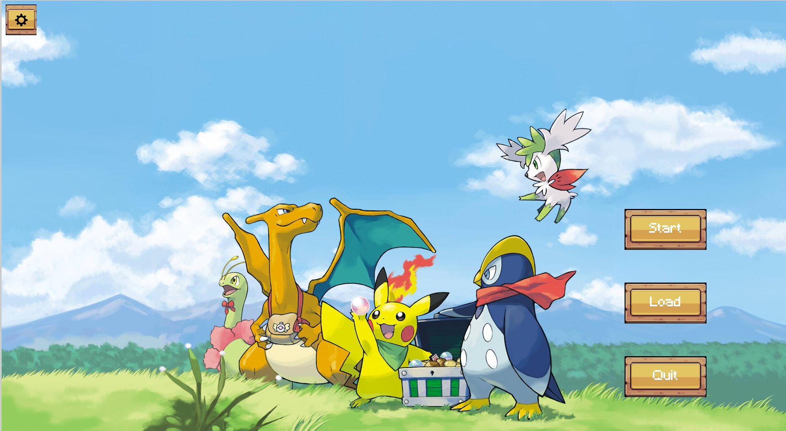
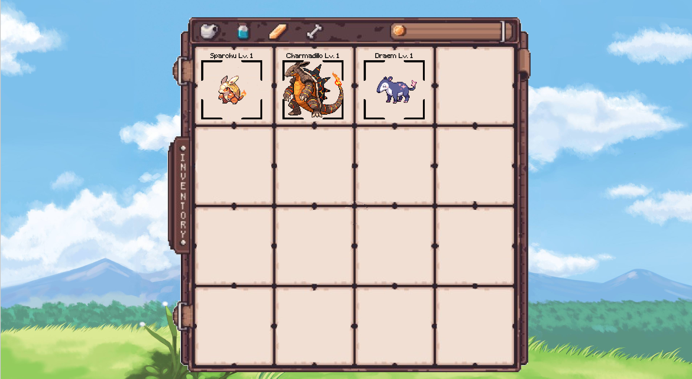
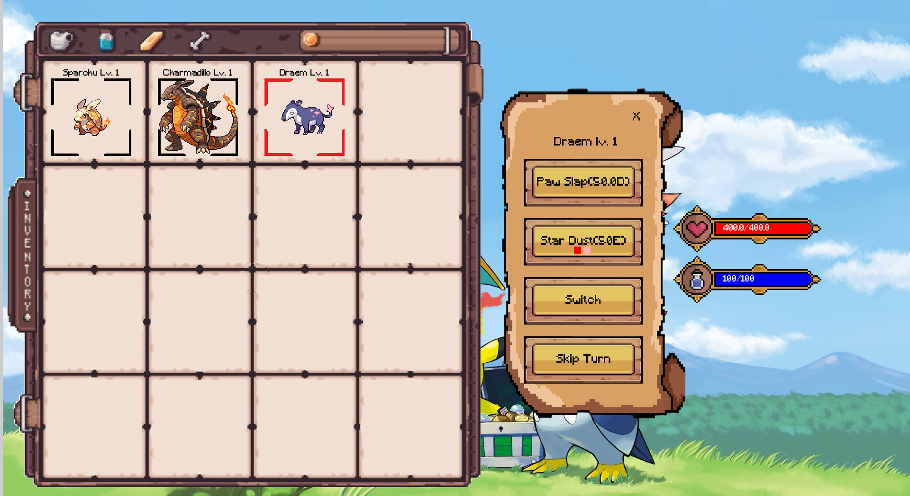
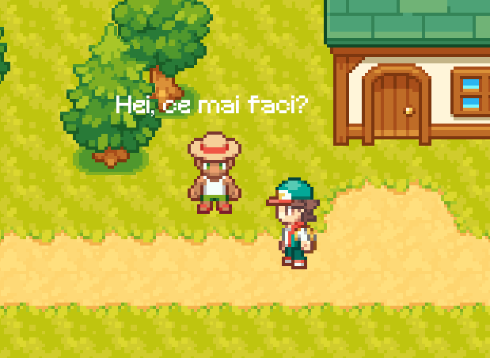
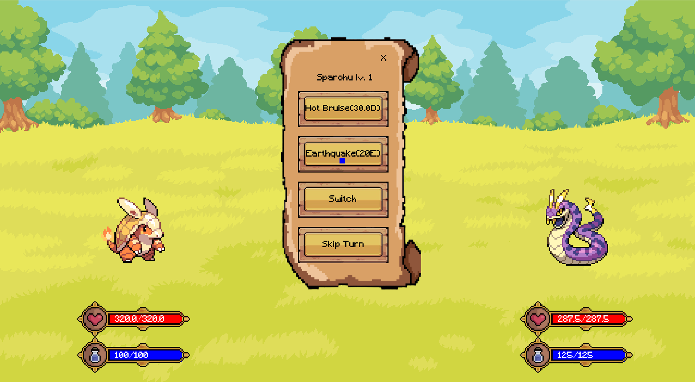
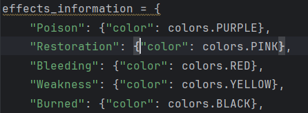
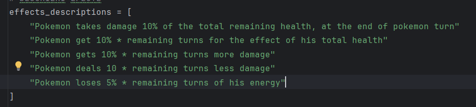
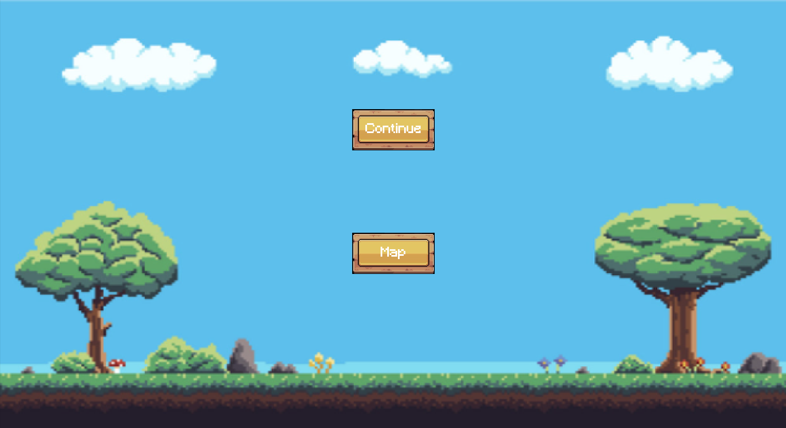
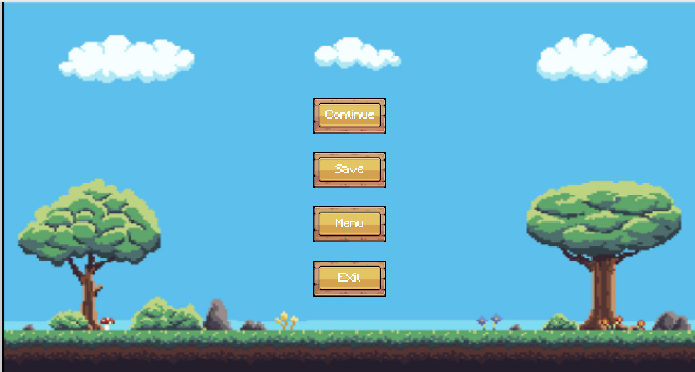

# Pokemon Game with PyGame

## Description

A Pokemon-inspired game developed using Python and PyGame. The game features tile-based maps spanning various environments such as forests and sandy landscapes. Players can navigate the map using WASD keys, interact with non-player characters (NPCs), and engage in battles with wild or NPC-controlled Pokemon.


When you open the game via the terminal using `python3 main.py` the first aspect you see is the Main Menu. It contains 4 buttons:
Start, Load, Exit and Settings (which is currently not implemented)



When you press start the game begins on the map where you can move up, left, right or down using the WASD keys. On the map, you can battle NPCs and also enter some buildings, some of these being arenas. The character on screen
is able to do multiple things on the map.
By pressing `E` you can open your inventory. Here you can see all of your Pokemon, right now these are the starting Pokemon



You can see that your Pokemon have a black box around them, this means that they are selected and you can enter in battle with them.
In every battle you will have to choose exactly 3 Pokemon. During tha game you are going to collect several Pokemon by fighting with
other NPC's Pokemon or wild ones.
In order to reselect the Pokemon you want to have in battle, you can press `R` in the inventory and choose 3 of them.
If you want to delete a Pokemon you can use the delete key and choose how many Pokemon you want to delete by clicking on them, when you are done,
press delete again to cancel.
To exit the menu press E again.
In the inventory you can also select a Pokemon in order to see its stats, by doing this you can see in the right its ability screen, health and energy / mana.
You can see that a particular Pokemon is selected because a red box is going to appear around it in the inventory



In order to fight other Pokemon in battle you have 2 options, either run around the grass located around the world and by doing this a random
Pokemon battle is going to start or by going to speak with other NPCs.
To talk to an NPC you have to press `F` next to it, after reading one of its lines press `F` again to show the next one until the battle starts.



In battle you can select your Pokemon and an ability screen is going to popup. If you want to speedrun the game (and for testing purposes), we set the Charmadillo attack to absurd levels.



The first button represents the main attack, this one only gives damage to the enemy. The damage is in paranthesis and followed by D.
The second button is the special ability, under the name there are some effects that the special ability apply to the other Pokemon
or if it is a good effect ofn itself.
These are the effects:



And this is what they do: hope the descriptions are ok :))



Some of the effects are applyed when you attack and some of them when you are attacked.
The effects appear next to the Pokemon, the color represent the effect and the number the turns it lasts. If you reattack with a specific
effect the turns add up. Every special attack gives two stacks of every effect it applies.
The third button allows you to change the Pokemon you want to attack with and the last one regens a third or `30%` of your energy/mana.

When the battle ends you have a chance to get one of the Pokemon you fought and you don t have. It's `100%` when you fight a NPC and `33%` when
you get a battle in the grass.

We also have implemented an exit menu. In the battle you have to options, either continue the battle or go to map. In the map you can do 
4 things: continue which I think is suggestive, menu which allows you to go to main menu, save which saves your progress and exit which 
closes your game.





Pressing Load in the Main Menu allows you to get back where you last time saved. 
**BE CAREFUL!** 
Starting the game again deletes your save.
We would like to implement in the future the ability to have multiple save files, but right now you cannot.

## Features

- **Interactive Map:**
  - Explore diverse biomes including forests and sandlands.
  - Seamless scene transitions between different game areas.
  - Collision detection to interact realistically with the environment.

- **Main Menu Interface:**
  - User-friendly main menu with options to Start, Load, Save, Exit, and Settings.
  - Visual buttons for easy navigation.

- **Inventory System:**
  - Manage and view collected Pokemon.
  - Select active Pokemon for battles.
  - Add new Pokemon to the inventory with a chance-based system.

- **Battle Mechanics:**
  - Engage in turn-based battles using selected Pokemon.
  - Utilize main attacks and special abilities with various effects.
  - Experience system for leveling up Pokemon.

- **Save and Load System:**
  - Save game progress, including inventory and player position.
  - Load saved data to resume gameplay.
  - Manage save files with the ability to remove old saves.

- **Sound and Graphics:**
  - Rich graphics and animations for an immersive experience.
  - Integrated sound effects and background music to enhance gameplay.


## Repository
   ```bash
   git clone git@github.com:IaniIrascu/Python-Game.git
   ```
Link: https://github.com/IaniIrascu/Python-Game

# Task Management

## Iani Irascu

### Map Implementation
I utilized **TMX files** (that I found online, fortunately) to design and manage the game's maps, ensuring flexibility and ease of modification. Each map comprises multiple layers allowing for detailed environment creation. The `Map` class in `map.py` is responsible for loading these TMX files and rendering the appropriate layers using PyGame. This setup enables  scene transitions and accurate collision detection.

### Sprite Management
Sprites in the game are handled through a structured system of classes including `Sprite`, `Animated`, `Grass`, `Collision`, and `Transition`. I organized sprite assets within dedicated folders, ensuring modularity and reusability. The `sprites.py` module manages the rendering and updating of these sprites, incorporating animations and interactions.

### NPC Implementation
NPCs are defined comprehensively within the `NPC_DATA` dictionary located in `npc_data.py`. Each NPC entry includes their `pokemon` team and `dialog` options. The `NPC` class extends the `Entity` base class, utilizing this data to control NPC behaviors and interactions. During map rendering, NPCs are instantiated based on the `Entities` layer from the TMX files, allowing them to interact with the player and the environment dynamically.

## Eugen-Cristian Cantaragiu

### Pokemon Implementation
I designed the Pokemon system to be highly customizable and interactive. Each Pokemon is represented by a class that includes attributes such as name, level, health, energy, and attacks. The Pokemon can level up, gain experience, and use special abilities with various effects.

### Battle Sequence
The battle sequence is a core feature of the game. I implemented a turn-based battle system where players can select their Pokemon and choose between main attacks and special abilities. Each ability has specific effects, which can be applied to the opponent or the player's Pokemon. The battle screen displays the health and energy bars, and I included animations to make the battles visually appealing. The outcome of each battle affects the player's progress, with chances to capture new Pokemon after defeating NPCs or wild Pokemon.

### Inventory System
The inventory system allows players to manage their collected Pokemon efficiently. I implemented an inventory class that stores the player's Pokemon, tracks the number of Pokemon, and manages active Pokemon for battles. The inventory also supports deleting Pokemon and viewing detailed stats, including health, energy, and abilities.

### Save and Load System
To ensure players can save their progress, I implemented a save and load system. Using the `pickle` module, I created methods to save the game state, including the player's inventory, position, and NPC data. The save files are stored in a designated folder, and players can load their saved data to resume gameplay from where they left off.


## Adelin-Stefan Dumitrache

### Menu Implementation
I designed the menu to be user-friendly and visually appealing. The menu includes options to Start, Load, Save and Exit. I used PyGame to create interactive buttons that respond to mouse events, providing visual feedback when hovered over or clicked.

### Sound and Music
I incorporated various sound effects and background music. I sourced the sounds and music from Youtube and pop culture. I then edited these audio files using Audacity to match the game's theme and requirements. I used PyGame's mixer module to handle the playback and control of these audio files.

### Animations
I implemented animations for character movements, attacks, and other interactions using sprite sheets. I organized the sprite assets within dedicated folders and used PyGame's built-in functions to handle the rendering and updating of these animations. By carefully timing the frame updates, I ensured that the animations were fluid and responsive.

## Virtual Environment Setup

1. `pip install virtualenv`

2. `python3 -m venv virtual-environment-name` (you should name it env / venv)

3. source `virtual-environment-name/bin/activate` (in wsl)

	3.  `virtual-environment-name/Scripts/Activate.ps1` (in Powershell)

4. `pip install -r requirements.txt`

### If you install a new package, `pip freeze -> requirements.txt`

## Docs

1. [PyGame Docs](https://www.pygame.org/docs/#tutorials)

## Git Best Practices

1. Always `git pull` and `pip install -r requirements.txt` before working on something new.
1. Work on a separate branch.
2. Make a PR that closes and issue and request a review.

